# 🛠️Firebase 를 사용한 간단한 SNS 만들기

<br/>
<p>


<p/>
<br/>

## 시작하기 전에...

- **Firebase** 는 **Google** 에서 제공하는 `back-end`
- 다만, 평소에 아는 `back-end` 가 아닌 편의성을 제공해주는 툴처럼 보는게 편함
- 사용하기 전 [Firebase](https://firebase.google.com/?hl=ko) 참고

<br/>
<hr/>

###### 202305014

> ## Firebase 연결하기

<br/>

<br/>

- `Firebase` 를 사용하기 위해선 [홈페이지](https://firebase.google.com/?hl=ko) 로 이동 후`Google` 로그인을 함
- `프로젝트 만들기` 를 클릭해 새 프로젝트를 생성
- `Firebase` 에서 제공하는 스크립트를 사용하기 위해 `npm install firebase` 설치
- 그 후 `firebase` 스크립트를 담아 둘 파일 생성

<br/>

```JS
//firebase.js
import { initializeApp } from "firebase/app";

const firebaseConfig = {
  apiKey: process.env.REACT_APP_API_KEY,
  authDomain: process.env.REACT_APP_AUTH_DOMAIN,
  projectId: process.env.REACT_APP_PROJECT_ID,
  storageBucket: process.env.REACT_APP_STORAGE_BUCKET,
  messagingSenderId: process.env.REACT_APP_MESSAGIN_ID,
  appId: process.env.REACT_APP_APP_ID,
}; // firebase 에서 제공하는 script

const app = initializeApp(firebaseConfig);

export default app;
```

<br/>

<br/>

설치 후 `console.log(firebase)` 로 찍어보면 정상 연결 된 것을 볼 수 있음

<br/>
<br/>
<hr/>

###### 202305016

> ## jsconfig.json 수정

<br/>

- `jsconfig.json` 파일 생성
- 해당하는 `baseUrl` 을 `src` 로 바꾸어 import 시 편리하게 변경
- `import` 기준 폴더 위치가 `src` 이므로 import 수정

<br/>

```JS
//App.js
import Router from "components/Router";
import fbase from "fbase";
import { authService } from "fbase";
```

<br/>

```json
{
  "compilerOptions": {
    "baseUrl": "src"
  },
  "include": ["src"]
}
```

<br/>

> ## getAuth()

<br/>

- `authService` 를 사용하기 위해 `getAuth()` 함수로 `firebase` 에서 연동
- `authService.currentUser` 는 현재 유저 정보를 불러오며 **User | null type** [공식문서 참고](https://firebase.google.com/docs/reference/js/v8/firebase.auth.Auth#currentuser)

<br/>

<br/>

```JS
// App.js
export default function App() {
  //   console.log(authService.currentUser);
  // authService 의 currentUser var 는 현재 유저정보를 불러옴 User | null

  const [isLogin, setIsLogin] = useState(authService.currentUser);
  return (
    <>
      <Router isLogin={isLogin} />
      <footer>&copy; {new Date().getFullYear()} Mwitter</footer>
    </>
  );
}
```

<br/>

<br/>

console.log() 를 찍어보면 아직 해당하는 유저값이 없으므로 null이 반환 되는 것을 볼 수 있음

<br/>
<br/>
<hr/>

###### 202305019

> ## Authentication 을 활용해 회원가입 만들기

<br/>

- `firebase` 는 자체 데이터베이스로 회원정보를 관리해줌
- `Authentication` 을 사용해 손쉽게 적용 가능
- 일반적인 email-password 형식뿐만 아니라 **Google**, **GitHub** 계정도 연동 할 수 있음

<br/>
<p>


<p/>
<br/>

`firebase > authentication` 으로 들어가면 여러 형식이 있음

하지만 **GitHub** 은 `github` 의 `Developer-settings` 로 가서 `secret-key` 를 받아와야 함

<br/>
<p>


<p/>
<br/>

`github login > developer settings > OAuth Apps`

<br/>

<br/>

`firebase` 의 `callback url` 위치를 사용해 입력

<br/>

<br/>

테스트를 하기 위한 `form tag` 생성

`Validation` 을 통과하면 `firebase/auth` 의 함수를 사용해 구현

<br/>

```JS
//Auth.js

  const onLoginValid = async (data) => {
    console.log(data);
    try {
      const auth = getAuth();
      const test = await signInWithEmailAndPassword(
        auth,
        data.loginId,
        data.loginPw
      );
      console.log(test);
    } catch (error) {
      console.log(`error : ${error}`);
    }
  }; // LoginForm validation 통과 시 작동, 특정함수는 공식문서 참고

    const onSignUpValid = async (data) => {
    console.log(data);
    try {
      const auth = getAuth();
      const test = await createUserWithEmailAndPassword(
        auth,
        data.signUpId,
        data.signUpPw
      );

      console.log(test);
    } catch (error) {
      console.log(`error : ${error}`);
    }
  };
```

<br/>

`createUserWithEmailAndPassword`, `signInWithEmailAndPassword` 함수 사용법은 [공식문서 참고](https://firebase.google.com/docs/auth/web/password-auth?hl=ko)

<br/>

<br/>

- `createUserWithEmailAndPassword` 을 이용해 email, password 를 입력해 회원가입 시도
- 회원가입 성공 시 자동으로 로그인 까지 되므로 로그인 값을 출력해 봄
- createUser**WithEmailAndPassword** 이므로 값을 주는 형식이 email 형식이어야 통과가 되므로 유의

<br/>

<br/>

`firebase` 를 확인해보면 정상적으로 값이 들어온 것을 확인 가능

<br/>

<br/>

`firebaseLocalStorage` 를 확인해보면 정상적으로 로그인이 성공했다는 것을 볼 수 있음

<br/>
<br/>
<hr/>

###### 202305021

> ## onAuthStateChanged() 로 Auth 의 상태체크

<br/>

- `firebase` 는 `onAuthStateChanged()` 함수로 `auth` 가 변했는지 유무를 확인 할 수 있음
- 해당 함수로 로그인 여부 조정 가능

<br/>

```JS
//App.js
  useEffect(() => {
    const auth = getAuth();
    onAuthStateChanged(auth, (user) => {
      if (user) {
        setIsLogin(true);
        const uid = user.uid;
      } else {
        setIsLogin(false);
      }
      setInit(true);
    });
  }, []);
```

<br/>

<br/>

`error.message` 로 `firebase` 에서 주는 에러메세지를 받아 사용할 수 있음

<br/>
<br/>
<hr/>

###### 202305023

> ## Google & GitHub 계정으로 로그인 하기

<br/>

- `firebase` 는 `Google` 과 `GitHub` 계정으로도 로그인 할 수 있음
- `GoogleAuthProvider`, `GithubAuthProvider`
- **new-pages** 방식과 **pop-up** 스타일이 있는데, 해당 페이지에선 **pop-up** 으로 만들 예정

<br/>

```JS
  const onSocialClick = async (event) => {
    const {
      target: { name },
    } = event;
    let provider;
    if (name === "google") {
      provider = new GoogleAuthProvider();
    } else if (name === "github") {
      provider = new GithubAuthProvider();
    }
    await signInWithPopup(authService, provider);
  }; // 자세한 내용은 공식문서 참고
```

<br/>

<br/>

`Google account` 로 로그인 시도 시 새로운 **팝업 창** 이 열림

<br/>

<br/>

`firebase > authentication` 을 확인하면 정상적으로 로그인 처리 된 모습을 볼 수 있음

<br/>

<br/>

<br/>

<br/>

`Github` 도 정상적으로 로그인 처리 된 것 을 볼 수 있음

> ## logout 생성하기

<br/>

- `Log-out` 을 구현하려면 `storage` 의 `key` 값을 지워주면 됨
- `signOut()` 함수로 간단하게 만들 수 있음

<br/>

```JS
//Profile.js
  const nav = useNavigate();

  const onLogOutClick = () => {
    authService.signOut();
    nav("/");
    // 로그아웃 후 main 화면으로 이동
  };
```

<br/>
<br/>
<hr/>

###### 202305024

> ## Firestore 에 chat 저장하기

<br/>

<br/>

`firebase` 의 `firestore` 를 사용해 `database` 에 접근해 `chat` 내용을 저장할 예정

<br/>
<p>
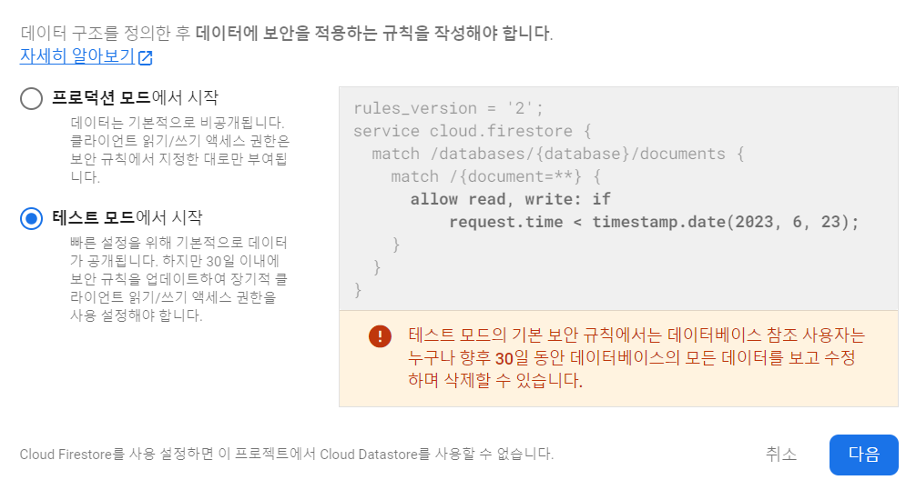

<p/>
<br/>

`firestore > test-mode` 로 생성

정상적으로 생성 된 모습. `firestore` 는 `no-sql` 기반 데이터 베이스임

<br/>
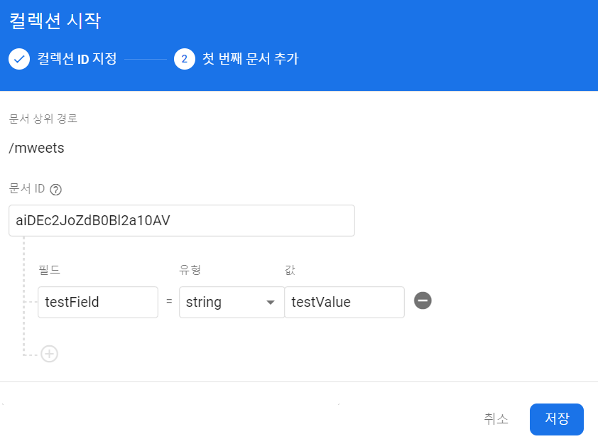
<br/>

`Collection-Start` 로 생성

<br/>
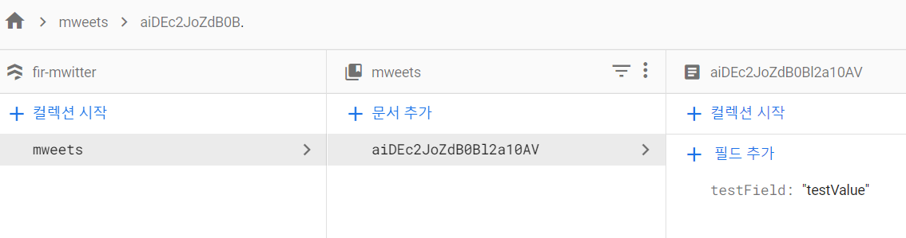
<br/>

`Document` 를 `chat` 으로 설계 할 것이며, `Field` 는 `chat` 내의 `value`. ex\) 작성날짜, 이름, 내용 ...

<br/>

```JS
//Home.js
/* --- React-Hook-Form 을 사용해 값을 전달했음 --- */

  const onValid = async (data) => {
    console.log(data.chat);
    try {
      const docRef = await addDoc(collection(dbService, "mweets"), {
        //document 추가하기 위해 addDoc 을 사용해 해당 collection 에 값을 작성 (mweets)
        mweet: data.chat,
        createdAt: Date.now(),
      });
      console.log("Document written with ID: ", docRef.id);
    } catch (error) {
      console.error("Error adding document: ", error);
    }

    setValue("chat", "");
    // onValid 통과시 input 을 비워주는 함수
  };

//fbase.js
import { getFirestore } from "firebase/firestore";

export const dbService = getFirestore();
// firebase 의 firestore 에 접근
```

<br/>
<p>
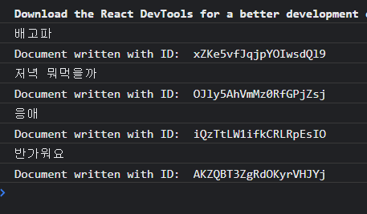
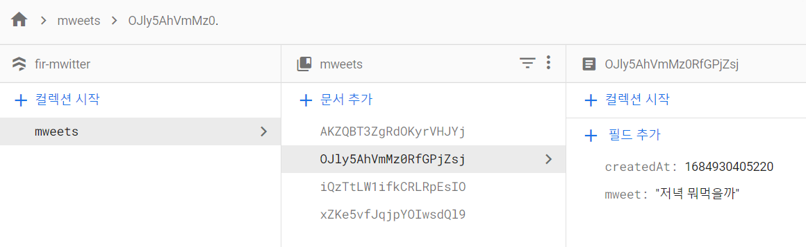
<p/>
<br/>

`console.log` 로 찍어 데이터가 정상적으로 들어가는 것을 확인

`firestore` 에서 정상적으로 `document` 와 `field` 값을 받은 것을 확인

<br/>
<br/>
<hr/>

###### 202305025

> ## Firestore 에 chat 가져오기

<br/>

- `firebase` 의 `firestore` 는 `document` 를 가져오기 위해선 `getDocs` 를 사용함
- 함수는 [공식문서 참고](https://firebase.google.com/docs/reference/js/v8/firebase.firestore.CollectionReference#get)

<br/>

```JS
//Home.js

  const [mweets, setMweets] = useState([]);

  const getMweets = async () => {
    const dbMweets = await getDocs(collection(dbService, "mweets"));
    // console.log(dbMweets);

    dbMweets.forEach((document) => {
      const mweetInstance = {
        ...document.data(),
        id: document.id,
      };
      // console.log(document.data());
      setMweets((prev) => [mweetInterface, ...prev]);
    });
  };

  useEffect(() => {
    getMweets();
  }, []);
```

`await getDocs(collection(dbService, "mweets"))` 로 `documents` 를 가져오고 `console.log` 를 찍으면

<br/>
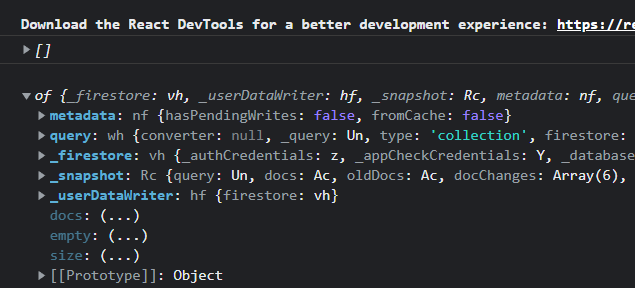
<br/>

해당하는 `query` 값이 나옴 하지만 이 형식은 우리가 원하는 형식이 아님

`data()` 함수로 데이터 값을 사용할 수 있음 [(공식문서 참고)](https://firebase.google.com/docs/reference/js/v8/firebase.firestore.QueryDocumentSnapshot#data)

<br/>
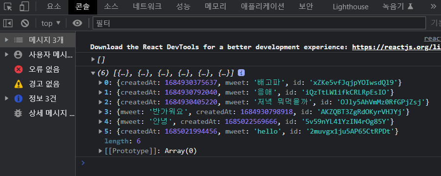
<br/>

`data()` 함수로 값을 뽑으며 `instance` 를 사용해 data-form 을 조정해 es6 문법으로 정의하여 넣은 모습

<br/>
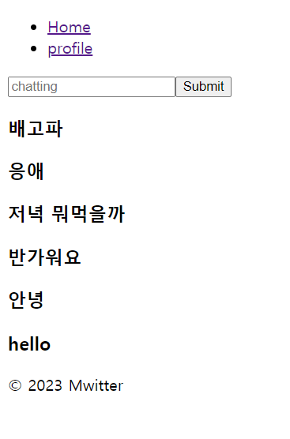
<br/>

값을 정상적으로 출력하는 모습

<br/>

```JS
// index.js

const root = ReactDOM.createRoot(document.getElementById("root"));
root.render(
  // <React.StrictMode>
    <App />
  // </React.StrictMode>
);
```

<br/>

- `StrictMode` 를 사용 시` side-effect`를 줄이기 위해 일부러 두번씩 실행시킴
- **dev-environment**에서만 두번씩 호출되고 **production**에서는 무시
- [문서 참고](https://reactjs.org/docs/strict-mode.html#detecting-unexpected-side-effects)

<br/>
<br/>
<hr/>

###### 202305027

> ## CRUD 의 update, delete 를 위해 field 생성

<br/>

- **CRUD(Create, Read, Update, Delete)** 중 **Update, Delete** 를 하기 위해선 **글을 작성한 userId** 가 필요함
- 따라서 새로운 `field` 생성

<br/>

```JS
//Home.js

  const onValid = async (data) => {
    // console.log(data.chat);
    try {
      const docRef = await addDoc(collection(dbService, "mweets"), {
        text: data.chat,
        createdAt: Date.now(),
        creatorId: userObj.uid,
        // 작성자의 id 추가
      });
      console.log("Document written with ID: ", docRef.id);
    } catch (error) {
      console.error("Error adding document: ", error);
    }

    setValue("chat", "");
    // onValid 통과시 input 을 비워주는 함수
  };

  ////////////////////////////

// App.js
    useEffect(() => {
    const auth = getAuth();
    onAuthStateChanged(auth, (user) => {
      if (user) {
        setIsLogin(true);
        setUserObj(user);
      } else {
        setIsLogin(false);
      }
      setInit(true);
    });
  }, []);
```

`userObj.uid` 는 `App.js` 의 `useEffect()` 내 **user-args** 에서 가져옴

<br/>
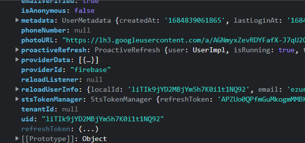
<br/>

<br/>
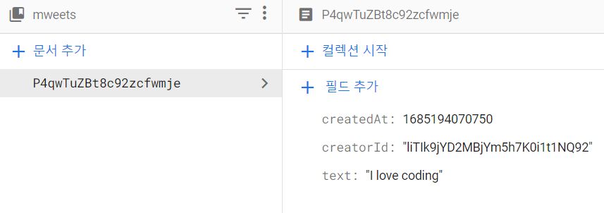
<br/>

새로운 `field` **creatorId** 를 정상적으로 생성해 주었음

<br/>

> ## real-time 으로 firestore 에 접근하기

<br/>

- **실시간으로** 데이터값을 조회하기 위해 기존의 `getMeets()` 가 아닌 `query` 에 접근하는 방식을 사용
- `query` 값으로 `firestore` 에 접근

<br/>

```JS
//Home.js

  useEffect(() => {
    // getMweets();
    const queryData = query(
      collection(dbService, "mweets"),
      orderBy("createdAt", "desc")
    );
  // query 값으로 fireStore 의 collection > mweets 에 접근함

    onSnapshot(queryData, (snapshot) => {
      // onSnapshot function 은 real-time 으로 query 에 접근해 데이터를 보여줄 수 있음
      console.log(snapshot.docs);
      const newArray = snapshot.docs.map((doc) => ({
        id: doc.id,
        ...doc.data(),
      }));
      console.log(newArray);
      setMweets(newArray);
    });
  }, []);
```

<br/>
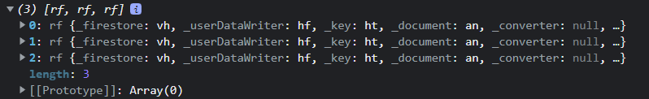
<br/>

`console.log(snapshot.doc)`. `query` 에 접근해 데이터 값이 3개 들어온 것을 확인 할 수 있음

map 함수를 이용해서 `newArray` 변수로 지정해 `reform` 해줄 예정

<br/>
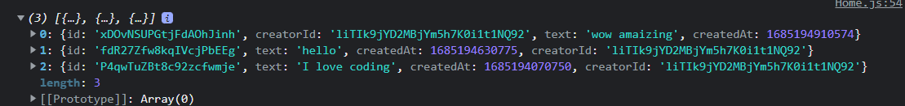
<br/>

`console.log(newArray)`. `getMweets()` 보다 나은 방식으로 새로운 배열로 `setMeets()` 를 해줄 수 있음

<br/>
<br/>
<hr/>

###### 202305029

> ## Owner-Check

<br/>

- 글을 지울때 글 작성자와 로그인 사용자가 서로 같아야만 지울 수 있게 설계
- 코드 재사용을 위해 **<Mweet/>** 으로 **refactoring** 하여 사용

<br/>

```JS
///Home.js
      <div>
        {mweets.map((data) => (
          <Mweet
            key={data.id}
            mweetObj={data}
            isOwner={data.creatorId === userObj.uid}
          />
        ))}
      </div>

//Mweet.js
export default function Mweet({ mweetObj, isOwner }) {
  return (
    <>
      <h4>{mweetObj.text}</h4>
      {isOwner && (
        <>
          <button>Delete</button>
          <button>Edit</button>
        </>
      )}
    </>
  );
}
```

<br/>
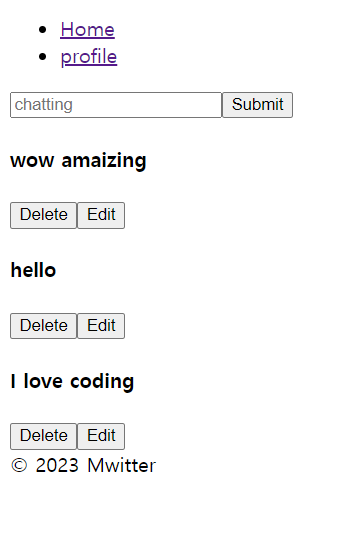
<br/>

작성글에 `Delete`, `Edit` 버튼을 생성

<br/>

<br/>

`fireStore` 에서 특정 글의 작성자 id 를 수정해보면

<br/>
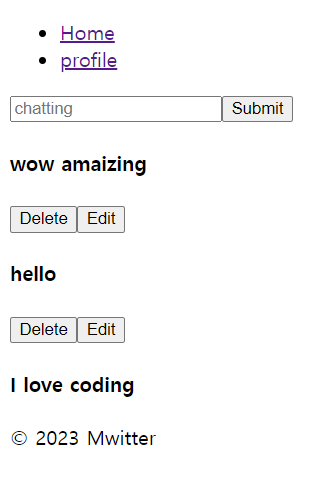
<br/>

해당하는 글만 수정버튼이 사라지는 것을 볼 수 있다.
