# 🛠️Firebase 를 사용한 간단한 SNS 만들기

<br/>
<p>


<p/>
<br/>

## 시작하기 전에...

- **Firebase** 는 **Google** 에서 제공하는 `back-end`
- 다만, 평소에 아는 `back-end` 가 아닌 편의성을 제공해주는 툴처럼 보는게 편함
- 사용하기 전 [Firebase](https://firebase.google.com/?hl=ko) 참고

<br/>
<hr/>

###### 202305014

> ## Firebase 연결하기

<br/>

<br/>

- `Firebase` 를 사용하기 위해선 [홈페이지](https://firebase.google.com/?hl=ko) 로 이동 후`Google` 로그인을 함
- `프로젝트 만들기` 를 클릭해 새 프로젝트를 생성
- `Firebase` 에서 제공하는 스크립트를 사용하기 위해 `npm install firebase` 설치
- 그 후 `firebase` 스크립트를 담아 둘 파일 생성

<br/>

```JS
//firebase.js
import { initializeApp } from "firebase/app";

const firebaseConfig = {
  apiKey: process.env.REACT_APP_API_KEY,
  authDomain: process.env.REACT_APP_AUTH_DOMAIN,
  projectId: process.env.REACT_APP_PROJECT_ID,
  storageBucket: process.env.REACT_APP_STORAGE_BUCKET,
  messagingSenderId: process.env.REACT_APP_MESSAGIN_ID,
  appId: process.env.REACT_APP_APP_ID,
}; // firebase 에서 제공하는 script

const app = initializeApp(firebaseConfig);

export default app;
```

<br/>

<br/>

설치 후 `console.log(firebase)` 로 찍어보면 정상 연결 된 것을 볼 수 있음

<br/>
<br/>
<hr/>

###### 202305016

> ## jsconfig.json 수정

<br/>

- `jsconfig.json` 파일 생성
- 해당하는 `baseUrl` 을 `src` 로 바꾸어 import 시 편리하게 변경
- `import` 기준 폴더 위치가 `src` 이므로 import 수정

<br/>

```JS
//App.js
import Router from "components/Router";
import fbase from "fbase";
import { authService } from "fbase";
```

<br/>

```json
{
  "compilerOptions": {
    "baseUrl": "src"
  },
  "include": ["src"]
}
```

<br/>

> ## getAuth()

<br/>

- `authService` 를 사용하기 위해 `getAuth()` 함수로 `firebase` 에서 연동
- `authService.currentUser` 는 현재 유저 정보를 불러오며 **User | null type** [공식문서 참고](https://firebase.google.com/docs/reference/js/v8/firebase.auth.Auth#currentuser)

<br/>

<br/>

```JS
// App.js
export default function App() {
  //   console.log(authService.currentUser);
  // authService 의 currentUser var 는 현재 유저정보를 불러옴 User | null

  const [isLogin, setIsLogin] = useState(authService.currentUser);
  return (
    <>
      <Router isLogin={isLogin} />
      <footer>&copy; {new Date().getFullYear()} Mwitter</footer>
    </>
  );
}
```

<br/>

<br/>

console.log() 를 찍어보면 아직 해당하는 유저값이 없으므로 null이 반환 되는 것을 볼 수 있음

<br/>
<br/>
<hr/>

###### 202305019

> ## Authentication 을 활용해 회원가입 만들기

<br/>

- `firebase` 는 자체 데이터베이스로 회원정보를 관리해줌
- `Authentication` 을 사용해 손쉽게 적용 가능
- 일반적인 email-password 형식뿐만 아니라 **Google**, **GitHub** 계정도 연동 할 수 있음

<br/>
<p>

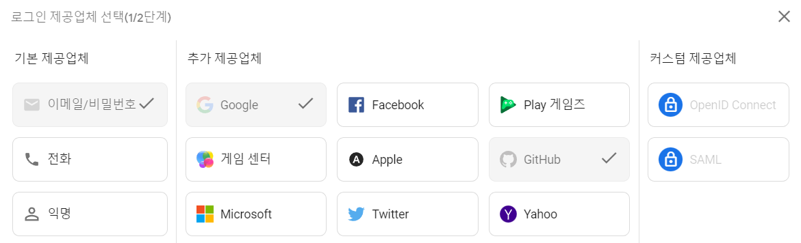
<p/>
<br/>

`firebase > authentication` 으로 들어가면 여러 형식이 있음

하지만 **GitHub** 은 `github` 의 `Developer-settings` 로 가서 `secret-key` 를 받아와야 함

<br/>
<p>
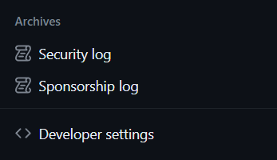

<p/>
<br/>

`github login > developer settings > OAuth Apps`

<br/>
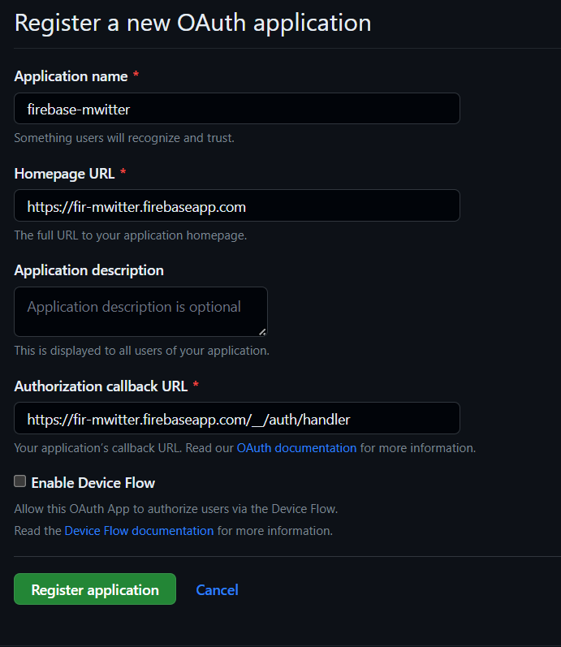
<br/>

`firebase` 의 `callback url` 위치를 사용해 입력

<br/>
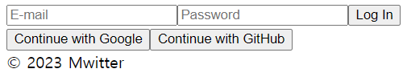
<br/>

테스트를 하기 위한 `form tag` 생성

`Validation` 을 통과하면 `firebase/auth` 의 함수를 사용해 구현

<br/>

```JS
//Auth.js

  const onLoginValid = async (data) => {
    console.log(data);
    try {
      const auth = getAuth();
      const test = await signInWithEmailAndPassword(
        auth,
        data.loginId,
        data.loginPw
      );
      console.log(test);
    } catch (error) {
      console.log(`error : ${error}`);
    }
  }; // LoginForm validation 통과 시 작동, 특정함수는 공식문서 참고

    const onSignUpValid = async (data) => {
    console.log(data);
    try {
      const auth = getAuth();
      const test = await createUserWithEmailAndPassword(
        auth,
        data.signUpId,
        data.signUpPw
      );

      console.log(test);
    } catch (error) {
      console.log(`error : ${error}`);
    }
  };
```

<br/>

`createUserWithEmailAndPassword`, `signInWithEmailAndPassword` 함수 사용법은 [공식문서 참고](https://firebase.google.com/docs/auth/web/password-auth?hl=ko)

<br/>
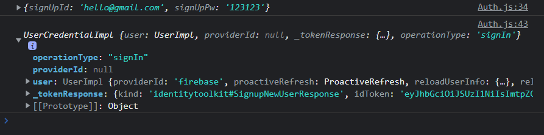
<br/>

- `createUserWithEmailAndPassword` 을 이용해 email, password 를 입력해 회원가입 시도
- 회원가입 성공 시 자동으로 로그인 까지 되므로 로그인 값을 출력해 봄
- createUser**WithEmailAndPassword** 이므로 값을 주는 형식이 email 형식이어야 통과가 되므로 유의

<br/>
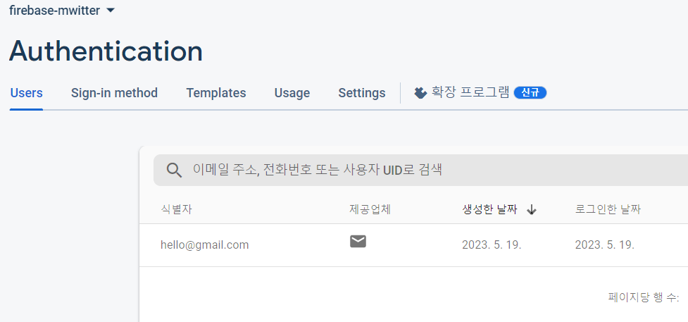
<br/>

`firebase` 를 확인해보면 정상적으로 값이 들어온 것을 확인 가능

<br/>
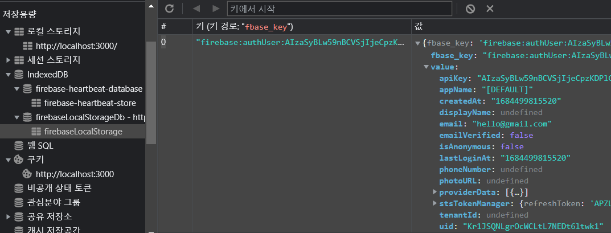
<br/>

`firebaseLocalStorage` 를 확인해보면 정상적으로 로그인이 성공했다는 것을 볼 수 있음

<br/>
<br/>
<hr/>

###### 202305021

> ## onAuthStateChanged() 로 Auth 의 상태체크

<br/>

- `firebase` 는 `onAuthStateChanged()` 함수로 `auth` 가 변했는지 유무를 확인 할 수 있음
- 해당 함수로 로그인 여부 조정 가능

<br/>

```JS
//App.js
  useEffect(() => {
    const auth = getAuth();
    onAuthStateChanged(auth, (user) => {
      if (user) {
        setIsLogin(true);
        const uid = user.uid;
      } else {
        setIsLogin(false);
      }
      setInit(true);
    });
  }, []);
```

<br/>
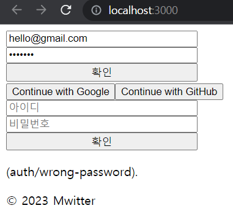
<br/>

`error.message` 로 `firebase` 에서 주는 에러메세지를 받아 사용할 수 있음

<br/>
<br/>
<hr/>

###### 202305023

> ## Google & GitHub 계정으로 로그인 하기

<br/>

- `firebase` 는 `Google` 과 `GitHub` 계정으로도 로그인 할 수 있음
- `GoogleAuthProvider`, `GithubAuthProvider`
- **new-pages** 방식과 **pop-up** 스타일이 있는데, 해당 페이지에선 **pop-up** 으로 만들 예정

<br/>

```JS
  const onSocialClick = async (event) => {
    const {
      target: { name },
    } = event;
    let provider;
    if (name === "google") {
      provider = new GoogleAuthProvider();
    } else if (name === "github") {
      provider = new GithubAuthProvider();
    }
    await signInWithPopup(authService, provider);
  }; // 자세한 내용은 공식문서 참고
```

<br/>
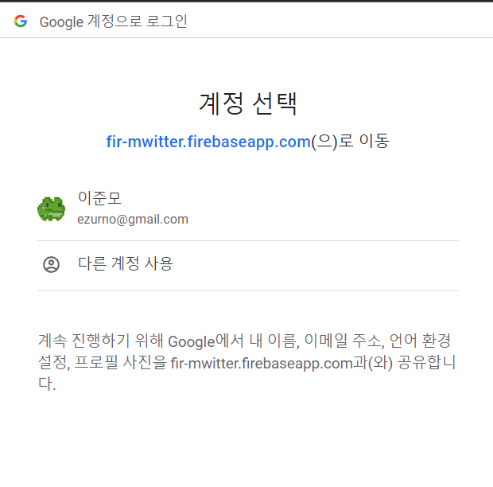
<br/>

`Google account` 로 로그인 시도 시 새로운 **팝업 창** 이 열림

<br/>
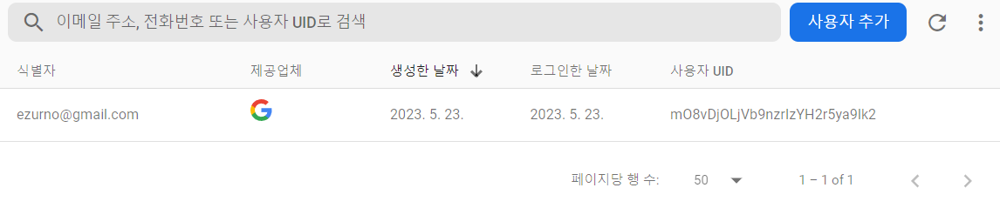
<br/>

`firebase > authentication` 을 확인하면 정상적으로 로그인 처리 된 모습을 볼 수 있음

<br/>
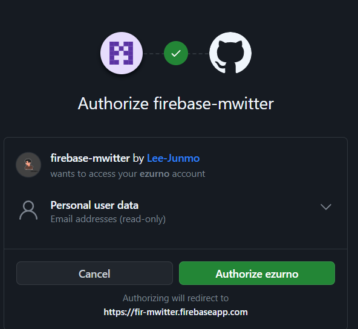
<br/>

<br/>
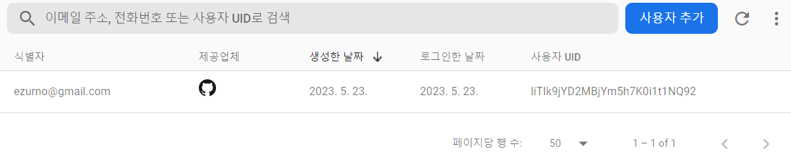
<br/>

`Github` 도 정상적으로 로그인 처리 된 것 을 볼 수 있음

> ## logout 생성하기

<br/>

- `Log-out` 을 구현하려면 `storage` 의 `key` 값을 지워주면 됨
- `signOut()` 함수로 간단하게 만들 수 있음

<br/>

```JS
//Profile.js
  const nav = useNavigate();

  const onLogOutClick = () => {
    authService.signOut();
    nav("/");
    // 로그아웃 후 main 화면으로 이동
  };
```
